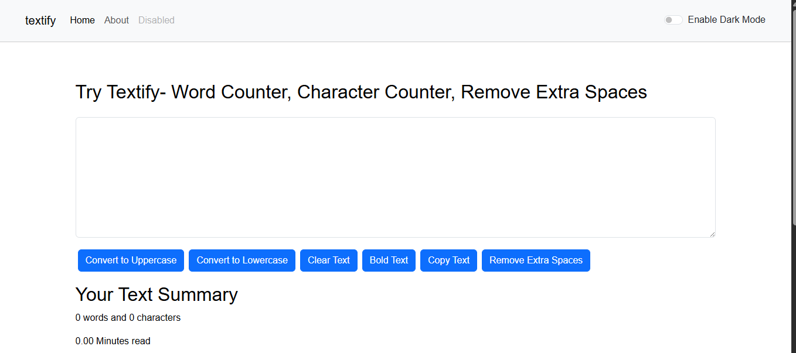

# 📝 Textify

**Textify** is a simple yet powerful text utility app built with React. It allows users to perform common text operations like converting text to uppercase/lowercase, clearing, copying, removing extra spaces, and more — all in a clean and responsive UI.

---

## 🚀 Live Demo

🔗 [View Live App] <!-- Replace if using a different hosting -->

---

## 🔧 Features

- 🔡 Convert text to uppercase & lowercase
- 🧹 Remove extra spaces
- 📋 Copy text to clipboard
- ❌ Clear text input
- 🌓 Toggle between light and dark mode
- 📱 Fully responsive design

---

## 🛠️ Tech Stack

- React
- JavaScript (ES6)
- HTML & CSS (with Bootstrap or custom styling)

---

## 📸 Screenshot

 <!-- Add this file to repo root -->

---

## 🧪 Getting Started

### Installation

```bash
git clone https://github.com/noor-1457/Textify.git
cd Textify
npm install

🙋‍♀️ Author
Noor Fatima
GitHub

